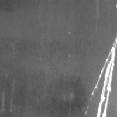
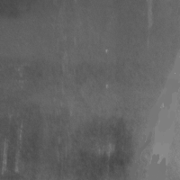

# 算法思路
1. 收集数据集
- 收集物体表面损伤相关的数据集
- 通过数据增强，制作一定数量的无缺陷表面图片和随机增强的无缺陷图片作为训练集。同理制作一部分测试集
    - 缺陷图片和无缺陷图片做差分获得划伤的差分图
    - 无缺陷和无缺陷(通过增强手段生成)进行差分获得无缺陷差分图
2. 图像预处理
- 对所有图片平滑去噪
- 对图片进行配准
- 对图像进行well算子增强
3. 计算差分图
将无缺陷的图片和有缺陷的图片进行差分获取有缺陷差分数据样本；无缺陷和无缺陷获得无缺陷的差分数据样本
4. 基于SVM算法对差分图数据集进行分类

# 数据集
东北大学工业缺陷数据集，[github中的为部分数据集]

---